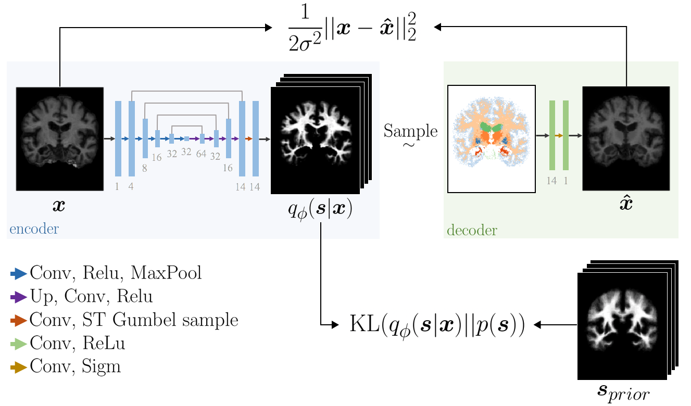

# An Auto-Encoder Strategy for Adaptive Image Segmentation

## Abstract
Deep neural networks are powerful tools for biomedical image segmentation. These models are often trained with heavy supervision, relying on pairs of images and corresponding voxel-level labels. However, obtaining segmentations of anatomical regions on a large number of cases can be prohibitively expensive. Furthermore, models trained with heavy supervision are often sensitive to shifts in image characteristics, for instance, due to a routine upgrade in scanner software. Thus there is a strong need for deep learning-based segmentation tools that do not require heavy supervision and can continuously adapt.  In this paper, we propose a novel perspective of segmentation as a discrete representation learning problem, and present a variational autoencoder segmentation strategy that is flexible and adaptive. Our method, called Segmentation Auto-Encoder (SAE), leverages all available unlabeled scans and merely requires a segmentation prior, which can be a single unpaired segmentation image. In experiments, we apply SAE to brain MRI scans. Our results show that SAE can produce good quality segmentations, particularly when the prior is good. We demonstrate that a Markov Random Field prior can yield significantly better results than a spatially independent prior. 

## Requirements
The code was tested on:
- python 3.6
- pytorch 1.1
- torchvision 0.3.0
- scikit-image 0.15.0
- scikit-learn 0.19.1
- matplotlib 3.0.2
- numpy 1.15.4
- tqdm 4.38.0

## Instruction

### Prepocessing 
T1-weighted 3D brain MRI scans was preprocessed using FreeSurfer [1]. This includes skull stripping, bias-field correction, intensity normalization, affine registration to Talairach space, and resampling to 1 mm3 isotropic resolution. The original images had a shape of 256x256x256, which was futher cut using ((48, 48), (31, 33), (3, 29)) along the sides to elimate empty space. 

Unfortunately, Buckner40 and its manual segmentation are not public dataset. However, we provide some example OASIS [2] volumes in `./data/vols/` and automatic segmentations in `./data/labels/`. The labels legend can be found in the [FreeSurfer webpage](https://surfer.nmr.mgh.harvard.edu/fswiki/FsTutorial/AnatomicalROI/FreeSurferColorLUT). We also provide the probabilistic atlas that we used in our experiment in the data folder. Check `functions/dataset.py` for further details on how we convert these numpy files into torch tensor. 

### Training
Once your MRI has been preprocessed, the next step is to obtain a good initialization for the encoder. This is accomplish by first mapping your training brain MRI to the probabilistic atlas. As an example, we provide our initialization in `./weights/pretrained_encoder.pth.tar`. However, we recommend pretraining your own encoder for your dataset in order to obtain the best results.

To train SAE, run `python train.py 0 2 --compute_dice`

Choose which of your gpus you want to use through `args.gpus`. Note that our current model only support `--args.batch_size=1` due to memory and computational constraint.

One important parameters in the script is `args.sigma`. Setting `args.sigma = 2` allows you to estimate the variance σ
in 1/(2σ2) ||x-x'|| as described in the paper. Setting `args.sigma = 0` allows you to set a fixed weight 
α to the reconstruction term α||x-x'||

The parameter `--args.beta` puts weight on the Lmrf. If this term is not 0, `--args.k` is used to determine the size of the neighboorhood constraint. 

Finally, `--compute_dice` allows you to track the dice score of your prediction agaisnt the ground truth label. This is *not* used for training or model selection, but it can help you debug your code during training. 

### Evaluation
Run `python test.py 0`. It will return a dictionary which can be loaded using `torch.load(result.pth.tar')['stat']`. It has 13 columns. The 12 first column contain the dice loss (1-dice) of 12 region of interest (rois). Namely: pallidum, amygdala, caudate, cerebral cortex, hippocampus, thalamus, putamen, cerebral wm, cerebellum cortex, lateral ventricle, cerebellum wm and brain-stem. The last column is the average of the rois.

## References
[1] Bruce Fischl. Freesurfer. Neuroimage, 62(2):774–781, 2012

[2] Marcus et al. Open access series of imaging studies (OASIS): cross-sectional MRI data
in young, middle aged, nondemented, and demented older adults. Journal of Cognitive
Neuroscience, 2007.
